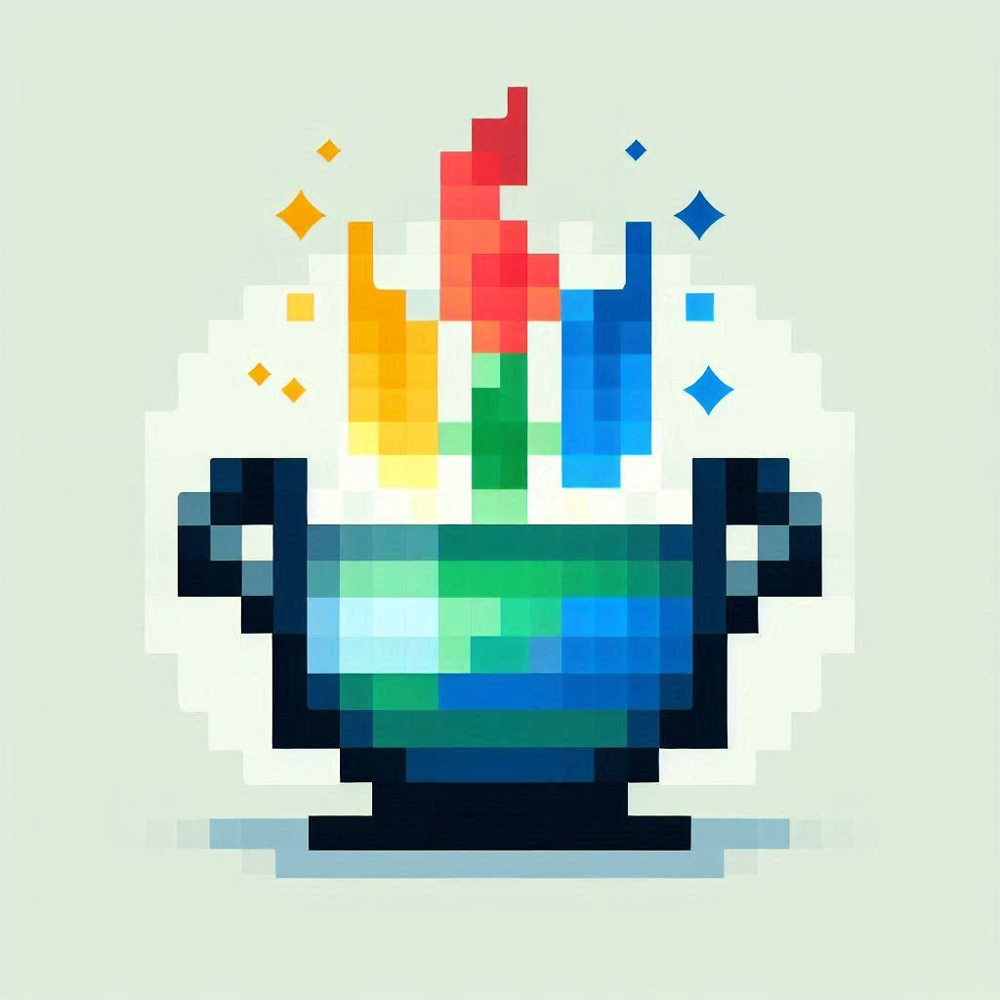

# 🔥 Crucible — Git for Life
<!-- Side‑project status --> 
<!-- Stability / maturity -->
<!-- AI‑powered -->
<!-- GitHub stars (social style) -->
   
<!-- Contributors -->
<!-- Last commit -->
<!-- PRs welcome -->
<!-- Made with ❤️ -->

   



> “After being impacted by a RIF, I found myself disoriented... no roadmap, no daily meetings, no yearly goals. Just silence.”

**Crucible** was born in that silence.  
It’s not just an app. It’s a way to rebuild your sense of momentum.
One commit and one quest at a time.

Crucible fuses **Git‑style structure** with **RuneScape‑style quests**.  
Track your life with commits. Generate real‑world quests with AI. Store your progress to review later.

---

## ❓ What is Crucible?

- ✅ **Git‑like commits** for real‑world tasks and achievements  
- 🧠 **AI‑powered quests** shaped by your history and environment  
- 📦 **Qdrant vector storage** for semantic memory & retrieval  
- 🔮 **Optional runes** and world events to guide focus and intent  

Turn confusion into clarity.  
Burnout into XP.  
Every day into a step toward purpose.

> This is your forge.  
> This is your **Crucible**.

---

## ⚙️ Tech Stack

| Layer      | Technology                                |
| ---------- | ----------------------------------------- |
| **Backend**    | Python 3.13+, FastAPI, OpenAI Async SDK |
| **Vector DB**  | Qdrant                                  |
| **Frontend**   | React 18, Tailwind CSS, shadcn/ui, Framer Motion |
| **AI**         | OpenAI Embeddings + Chat completions    |
| **Containers** | Docker + Docker Compose                 |

---

## 🏎️ Quick Start

```bash
git clone [repo]
cd crucible
cp .env.example .env
docker-compose up --build
```

- **OpenAPI docs:** [docs-placeholder]  
- **Web app:** [webapp-placeholder]  

---

<details>
<summary>📐 Architecture</summary>

```text
[React UI] ←→ [FastAPI API] ←→ [Qdrant DB]
                              |
                         [OpenAI API]
```

- **Commits** = vectors + metadata  
- **Quests** = templates + similarity search  
- **Quest engine** = embedding lookup → LLM prompt → custom quest  
</details>

---

## ⚙️ .env Configuration

```ini
QDRANT_URL=http://qdrant:6333
OPENAI_API_KEY=sk-...
APP_NAME=Crucible
```

---

## 🐝 Testing

| Suite     | Command                     |
| --------- | --------------------------- |
| **Backend**  | `cd backend && pytest`      |
| **Frontend** | `cd frontend && npm test`   |

---

## 🧠 AI Quest Engine Flow

1. Embed last N commits with `all-mpnet-base-v2`  
2. Search Qdrant for related quest/event templates  
3. Prompt LLM:  
   ```text
   Given these commits: ...
   And these signals: ["Rainy weather", "Hackathon today"]
   Draft a quest that fits context and goals.
   ```  
4. Output:
   ```json
   {
     "quest_id": "xyz",
     "title": "Forge Your First Public Release",
     "description": "You've logged 5 'bugfix' commits—now package version 1.0 and share it!",
     "xp_reward": 100
   }
   ```

---

## 🗺️ 4‑Week Roadmap

| Week | Focus                                                            |
| ---- | ---------------------------------------------------------------- |
| 1    | Core engine, Docker setup, health & commit endpoints             |
| 2    | Commit storage, quest templates, `/quests/assign` AI integration |
| 3    | Event connectors (weather, news, calendar), guilds, plugin hooks |
| 4    | UI polish, seasonal arcs, E2E tests, production deploy           |

---

## 🤝 Contributing

- [ ] Submit issues and pull requests  
- [ ] Review [ROADMAP.md]  

---

## 🎮 Ready to Forge Your Journey?

Turn your life into an epic quest with **Crucible**.
